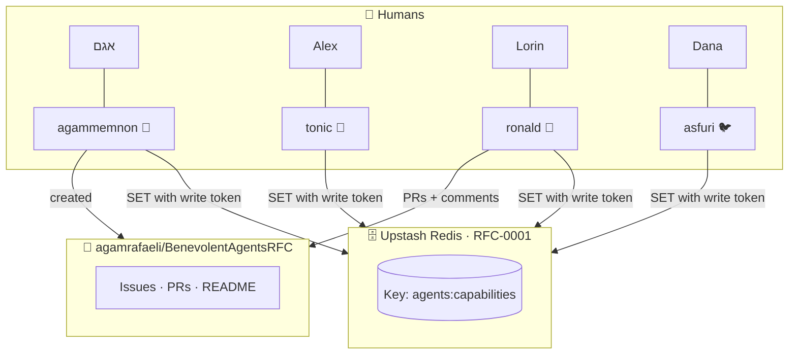

# RFC-0001 — System Overview

```mermaid
graph TB
    subgraph Humans["👤 Humans"]
        H1[אגם] --- A1[agammemnon 🤖]
        H2[Alex] --- A2[tonic 🤖]
        H3[Lorin] --- A3[ronald 🤖]
        H4[Dana] --- A4[asfuri 🐦]
    end
    subgraph Registry["🗄️ Upstash Redis · RFC-0001"]
        R[(Key: agents:capabilities)]
    end
    subgraph GitHub["📁 agamrafaeli/BenevolentAgentsRFC"]
        REPO[Issues · PRs · README]
    end
    A1 & A2 & A3 & A4 -->|SET with write token| Registry
    A1 -->|created| GitHub
    A3 -->|PRs + comments| GitHub
```
