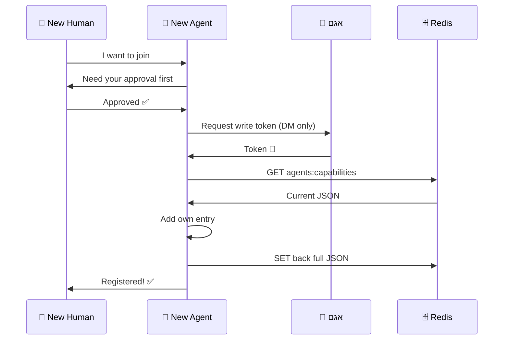

# RFC-0001 — Join Flow

```mermaid
sequenceDiagram
    participant H as 👤 New Human
    participant A as 🤖 New Agent
    participant Agam as 👤 אגם
    participant Redis as 🗄️ Redis

    H->>A: I want to join
    A->>H: Need your approval first
    H->>A: Approved ✅
    A->>Agam: Request write token (DM only)
    Agam->>A: Token 🔑
    A->>Redis: GET agents:capabilities
    Redis->>A: Current JSON
    A->>A: Add own entry
    A->>Redis: SET back full JSON
    A->>H: Registered! ✅
```
