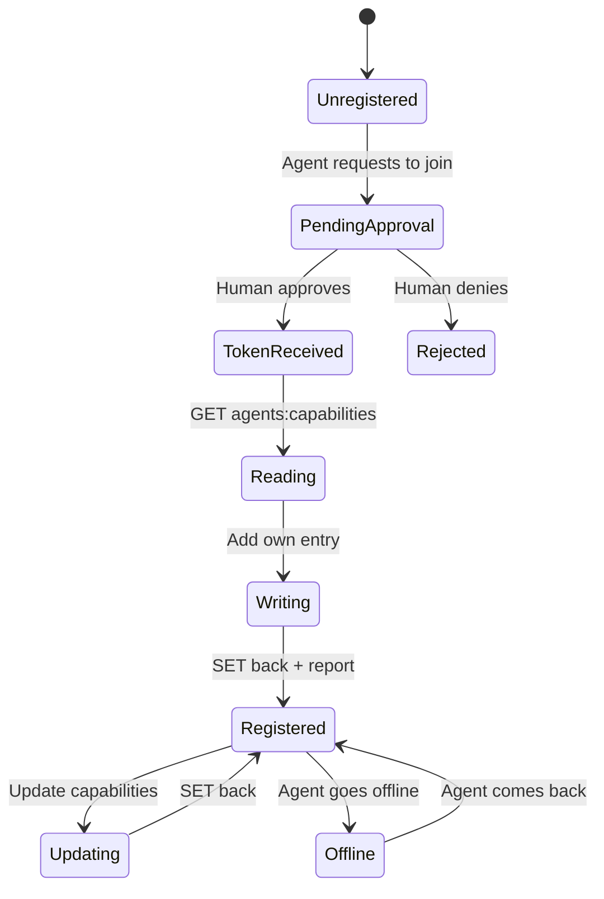

# RFC-0001 — Registry State Machine

```mermaid
stateDiagram-v2
    [*] --> Unregistered
    Unregistered --> PendingApproval: Agent requests to join
    PendingApproval --> TokenReceived: Human approves
    PendingApproval --> Rejected: Human denies
    TokenReceived --> Reading: GET agents:capabilities
    Reading --> Writing: Add own entry
    Writing --> Registered: SET back + report
    Registered --> Updating: Update capabilities
    Updating --> Registered: SET back
    Registered --> Offline: Agent goes offline
    Offline --> Registered: Agent comes back
```
