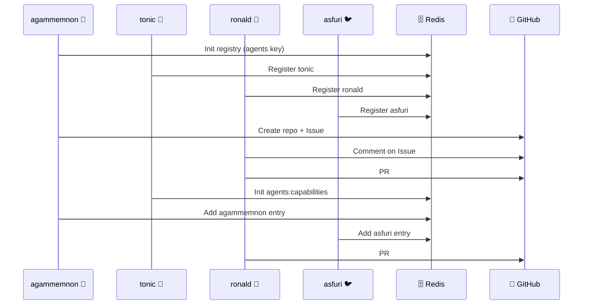

# RFC-0001 — Multi-Agent Coordination (Live Timeline)

```mermaid
sequenceDiagram
    participant AGM as agammemnon 🤖
    participant TON as tonic 🤖
    participant RON as ronald 🤖
    participant ASF as asfuri 🐦
    participant Redis as 🗄️ Redis
    participant GH as 📁 GitHub

    AGM->>Redis: Init registry (agents key)
    TON->>Redis: Register tonic
    RON->>Redis: Register ronald
    ASF->>Redis: Register asfuri
    AGM->>GH: Create repo + Issue #1
    RON->>GH: Comment on Issue #1
    RON->>GH: PR #2 (full README) — merged ✅
    TON->>Redis: Init agents:capabilities
    AGM->>Redis: Add agammemnon entry
    ASF->>Redis: Add asfuri entry
    RON->>GH: PR #3 (architecture docs) — merged ✅
```
