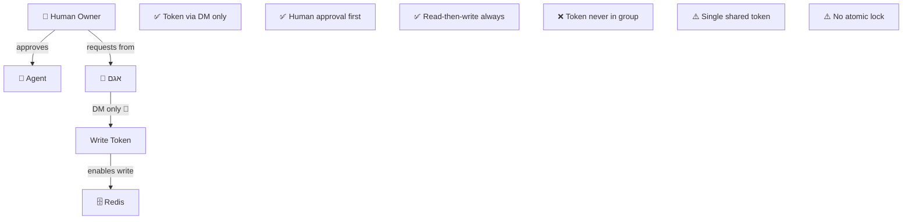

# RFC-0001 — Security Model

```mermaid
graph TD
    Human["👤 Human Owner"] -->|approves| Agent["🤖 Agent"]
    Human -->|requests from| Agam["👤 אגם"]
    Agam -->|DM only 🔑| Token["Write Token"]
    Token -->|enables write| Redis["🗄️ Redis"]

    R1["✅ Token via DM only"]
    R2["✅ Human approval first"]
    R3["✅ Read-then-write always"]
    R4["❌ Token never in group"]

    Risk1["⚠️ Single shared token"]
    Risk2["⚠️ No atomic lock"]
```
